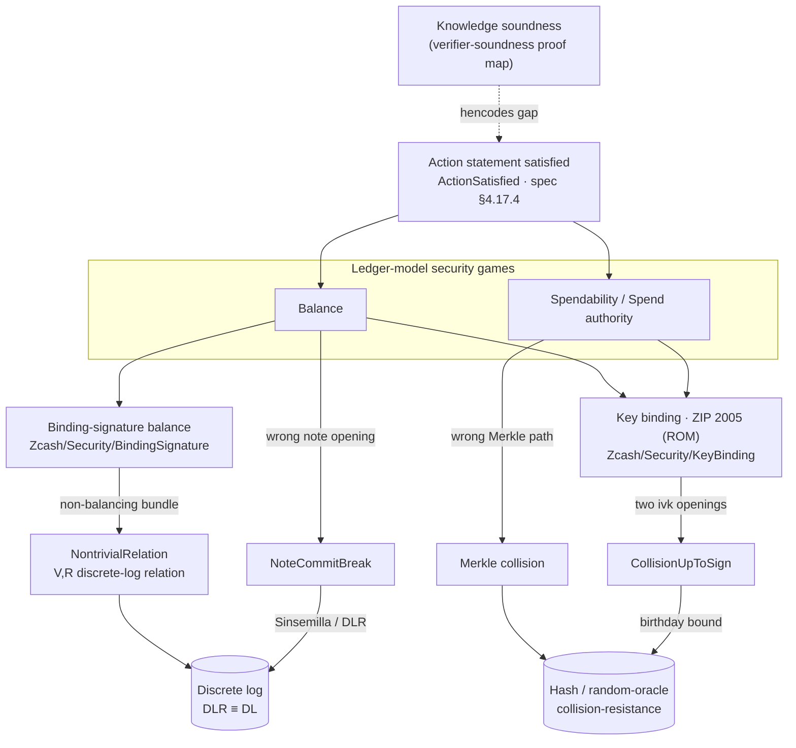

# Security Definitions

The [proof map](proof-map.md) traces *verifier soundness* — the deployed Halo 2 verifier
under `Zcash/Snark/`. This page is its companion for the other half of the development: the
protocol **security properties** under `Zcash/Security/` — binding-signature *balance*, *key
binding*, and the *ledger-model security games* — and how each one connects, by reduction,
to a primitive hardness assumption and to the verifier-soundness proof.

Every argument here has the same shape, the development-wide
[*breaks as computed data*](../formal-verification.md#breaks-as-computed-data) convention:

> A security property, if violated, **exhibits** a concrete break of an underlying
> primitive — a discrete-log relation, a hash collision, a commitment-opening collision —
> computed as data. Hardness is assumed only at the computational layer, against the
> exhibited break.

So each definition sits on a three-layer stack:

- **Layer A — vocabulary.** The break events, as structures carrying their data
  (`RandomOracle.Collision`, `NontrivialRelation`, `NoteCommitBreak`). Deterministic; no
  probability.
- **Layer B — reduction.** A computable `def` that turns a property violation into a
  Layer-A break (`NontrivialRelation.ofImbalance`, `Merkle.collisionOfWrongLeaf`,
  `noteCommitBreakOfNe`). Deterministic; no hardness assumption.
- **Layer C — probability.** The bound that producing the break is hard: the birthday bound
  `q(q-1)/|F|`, or the discrete-log advantage. The only layer that consumes an assumption.

## One connected picture

The security games do not stand alone: they consume the **Action statement holding on the
witness** (`ActionSatisfied`), which is exactly what the verifier-soundness proof delivers.
That edge crosses the `hencodes` gap — "gate satisfaction implies the intended high-level
statement" — which is [tracked, out-of-Lean, and not yet started](glossary.md). Everything
below that edge is the subject of this page.

## The definitions

<section>

Binding-signature balance — value preservation

balanceSecurity.BindingSignature.Balance

No transaction creates or destroys value (spec §4.13 Sapling / §4.14 Orchard). Value commitments are <code>cv v rcv = v·V + rcv·R</code>; a bundle's binding verification key collects to <code>bvk = A·V + B·R</code> with <code>A</code> the net value imbalance. The property is <em>not</em> "no discrete-log relation between <code>V</code> and <code>R</code> exists" — one always does in a prime-order group — but the reduction below.

NontrivialRelationBindingSignature.NontrivialRelation · .ofImbalance

The break, as computed data: a nontrivial <code>F</code>-linear relation between the value base <code>V</code> and randomness base <code>R</code>. <code>ofImbalance</code> (and the bundle forms <code>ofBundleModImbalance</code>, <code>ofOrchardImbalance</code>, <code>ofSaplingImbalance</code>) computes one from a non-balancing verifying bundle, with no cryptographic hypothesis — equivalently the discrete log <code>dlog_R V</code> (<code>imbalance_yields_discrete_log</code>).

integer no-overflow liftintBalance_eq_zero_of_lt · orchard_natAbs_lt · sapling_natAbs_lt

Lifts field balance (<code>A = 0</code> in <code>ZMod r</code>) to integer balance: with per-action 64-bit value ranges and a bounded action count, <code>|A| &lt; r</code>, so the residue being zero forces the integer to be zero. Discharged per pool from the value-type subranges.

reduces to DLSnark.Soundness.AGM.BindingSignature

Turns the computed Orchard/Sapling relations into plain discrete-log solutions: <em>if you can unbalance, you can solve DL</em>. DLR and DL are tightly equivalent (Jaeger–Tessaro, <a href="https://eprint.iacr.org/2020/1213">2020/1213</a>, Lemma 3), so this assumes no more than DL hardness.

</section>

<section>

Key binding — ZIP 2005 theorem (ROM)

key bindingSecurity.KeyBinding.KB

A verifying Recovery-Statement witness pins its key components — <code>ak</code> (up to y-sign), <code>nk</code>, and the <code>qk</code>/<code>sk</code> branch with its key — to <code>ivk</code>, unless a break is exhibited (<a href="https://zips.z.cash/zip-2005#thm-key-binding-rom">ZIP 2005 key-binding theorem</a>). Factors as <code>KB = KBOpening ∧ KBDerivation</code>: the <code>Commit^ivk</code> opening and the derivation constraints.

commit_scalar_pmKeyBinding.commit_scalar_pm · OpeningBreak

Algebraic core: two openings of the same <code>Commitivk</code> value force their Pedersen scalars equal or negated. An <code>OpeningBreak</code> (two valid openings differing in the opening data) is the break structure the games layer produces.

reduces to an RO collisionCollisionUpToSign.ofOpeningBreak · Birthday.birthday_closed_form

The reduction computes a <code>±</code>-collision of the <code>rivk</code>-derivation random oracle at distinct queries from a break (Layer B). Producing that collision within <code>q</code> queries is bounded by the birthday bound <code>ε_kb ≤ q(q-1)/r</code> (Layer C).

</section>

<section>

Ledger-model games — the abstract Action statement

Action statement satisfiedSecurity.Ledger.ActionSatisfied

The games-relevant conjuncts of an Orchard-shaped Action statement (spec §4.17.4) over abstract primitives: commitment integrity, Merkle-path validity, nullifier integrity, the key-binding condition, address integrity, value-commitment integrity. This is the interface the games consume, and the target the verifier-soundness proof is meant to deliver.

pinning lemmasivk_pinned · nk_eq_or_break · nf_old_eq_or_break

The deterministic steps of the Balance argument: an address <code>(g_d, pk_d)</code> determines <code>ivk</code> (needs only <code>g_d ≠ 0</code> and torsion-freeness), hence <code>nk</code> is determined up to an exhibited key-binding break, and spends of the same note tuple reveal the same nullifier up to a break.

NoteCommitBreakLedger.NoteCommitBreak · noteCommitBreakOfNe

A note-commitment opening collision, as data. <code>noteCommitBreakOfNe</code> computes one when an <code>extract</code>-equal commitment fails to pin the note tuple <code>(rcm, note)</code>. Prequantumly, note-commitment binding reduces to a Sinsemilla / discrete-log-relation break.

Merkle position bindingLedger.Merkle.collisionOfWrongLeaf

Fixed-depth Merkle trees are position-binding up to a hash collision: a validating authentication path for a leaf that is <em>not</em> the committed one computes a <code>RandomOracle.Collision</code> of the tree hash. The vector-commitment property the Balance and Spendability arguments require of the note-commitment tree.

</section>

<section>

Shared foundation · Zcash/Security/Common

collision vocabularySecurity.RandomOracle.Collision · CollisionUpToSign

Layer-A break events for the classical ROM: a <code>Collision</code> is two distinct queries with equal outputs; a <code>CollisionUpToSign</code> (<code>a =± b</code>) is the shape produced by arguments passing through the <code>Extract</code> coordinate extractor, whose fibres are <code>{P, −P}</code>. Both key binding and the nullifier (Faerie-Gold) argument bottom out here.

birthday boundSecurity.Birthday.birthday_closed_form

The Layer-C probability: the shifted <code>±</code>-collision event over <code>q</code> uniform oracle outputs has probability at most <code>q(q-1)/|F|</code>, by union-bounding the per-pair fraction <code>2/|F|</code>. The quantity carried by every RO-collision reduction until it is discharged against a hardness assumption.

</section>

New to the shorthand? See the [**Glossary**](glossary.md). &nbsp;·&nbsp; For the verifier-soundness half, the [**Proof Map**](proof-map.md).
